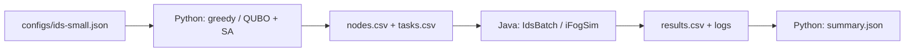

# Fog/Edge IDS Scheduling Research

A runnable research prototype for assigning IDS inference tasks to edge, fog,
and cloud nodes. Python builds a placement QUBO and solves it with classical
simulated annealing (SA); iFogSim2 executes the assignments with network queues
and CPU sharing. A greedy baseline and a small exact oracle are included.

The formulation adapts the penalty-encoding pattern from
[Q-GARS](https://arxiv.org/abs/2603.23127). It is not a reproduction of its ranking
scheduler, SQA solver, or theoretical guarantees. See the
[model and implementation notes (Russian)](docs/ids-minimal.md) for equations,
assumptions, and tests. Reviewed papers are in [papers/](papers/README.md).

## Quick Start

From the repository root, with the environment already installed:

```bash
source .venv/bin/activate
fogids doctor
fogids ids-demo
```

The default experiment uses six synthetic, ready-to-process feature windows and
three nodes. It runs greedy and QUBO + SA, each with and without measured decision
delay. Outputs are written to `artifacts/ids-small/`, including `summary.json`,
per-task CSV results, the QUBO, and Java logs. No real DL inference is executed.

To use a different configuration or output directory:

```bash
fogids ids-demo --config configs/ids-small.json --output artifacts/my-run
```

Rerunning into the same output directory overwrites files with the same names.
The tiny exact-oracle demo accepts 1–8 tasks and the fixed edge → fog → cloud topology.

Run the tests:

```bash
.venv/bin/python -m unittest discover -s tests -v
```

The 10 tests cover QUBO expansion, feasible-assignment costs, bounded slack,
seeded SA, configuration validation, and Java integration. Simulation checks
include local compute time, cloud network transfer, shared CPU execution,
decision delay, and unfinished tasks.

## How Python Connects to iFogSim

The current bridge uses **CSV files and a JVM subprocess**. Python computes an
assignment before starting the simulation; Java reads and executes that assignment.
Java does not call Python during simulation, and there is no persistent RPC service yet.



1. [`experiment.py`](src/fogids/experiment.py) loads and validates the scenario,
   constructs a feasible greedy incumbent, and calls [`qubo.py`](src/fogids/qubo.py).
   The exact oracle enumerates small assignments for comparison; it does not
   replace the SA result.
2. Python writes node definitions and task assignments, compiles
   [`IdsBatch.java`](java/org/fogids/IdsBatch.java) with `javac`, and launches
   `org.fogids.IdsBatch` through `subprocess`. Arguments specify input/output paths,
   release time, decision delay, and simulation horizon. Base classes and libraries
   come from the pinned iFogSim checkout.
3. Java creates three `FogDevice` nodes in an edge → fog → cloud chain, with one
   IDS `AppModule` per node. Ready feature windows enter at edge as `Tuple` objects
   addressed to the selected replica. iFogSim models uplink transmission and queues;
   CloudSim models time-shared CPU execution.
4. Java records completion on `CLOUDLET_RETURN`. Python reads these results and
   computes latency and deadline misses. Each of the four modes uses a fresh JVM.

### File Contract and Units

| Output file | Contents |
|---|---|
| `config.json` | Copy of the scenario configuration |
| `nodes.csv` | `name, mips, uplink_bytes_s, uplink_latency_s` |
| `<mode>-tasks.csv` | `id, node_index, compute_mi, input_bytes, deadline_s` |
| `<mode>-results.csv` | `task_id, node, completed, latency_s, deadline_s, missed` |
| `qubo.json` | Variable labels, upper-triangular coefficients, constant offset |
| `<mode>.log` | Java process output |
| `summary.json` | Assignments, surrogate costs, optimization timings, completion metrics |

Node indices follow the configuration: 0=edge, 1=fog, 2=cloud. Time is in
seconds, work in MI, CPU speed in MIPS, sizes in bytes, and bandwidth in bytes/s.
`deadline_s` is relative to feature-window readiness. Latency ends at inference
completion; feature extraction and alert delivery are outside this initial scenario.
Priorities are supplied inputs, not ground-truth attack labels.

### Decision Time Is Part of the Experiment

| Mode | Delay before applying the assignment |
|---|---|
| `greedy` | Zero: isolates the effect of placement |
| `qubo_sa` | Zero: isolates the effect of placement |
| `greedy_with_delay` | Measured greedy computation time |
| `qubo_sa_with_delay` | Greedy + QUBO construction/encoding + SA + decoding |

For `with_delay` modes, Java injects tasks at `release + decision_delay`, while
latency and deadlines are measured from `release`. Optimization therefore consumes
simulated time. Exact-oracle evaluation, file writing, compilation, and JVM startup
are excluded from decision delay as test-harness overhead. Java process wall time
is reported separately; **it is not a measurement of future RPC latency**.

Unfinished tasks count as deadline misses. Mean and maximum latency refer only
to completed tasks. Deadline comparison allows 10 microseconds of numerical tolerance;
the CPU update interval is 0.01 seconds. SA is seeded, but measured wall-clock
runtime depends on the machine and load.

### Local CPU Adapter

The pinned upstream `TupleScheduler` inherits an empty `getCurrentRequestedMips()`.
Periodic `PowerHost` updates consequently revoked CPU allocation in this finite-batch
scenario. The local `InferenceScheduler` reports full node CPU demand while busy
and zero while idle; standard time sharing distributes it among tasks within the
replica. The upstream checkout is unchanged. Analytic integration tests validate
single-task execution and two tasks sharing one CPU.

## QUBO Scope

Binary `y[i,m]` assigns task i to node m. The model uses one-hot task assignment
and integer node work budgets encoded with bounded binary slack. Its nonnegative
surrogate combines predicted latency, weighted tardiness, and a pairwise contention
proxy. A node work budget is an admission constraint over a configured compute
horizon, not a guarantee that all assigned tasks finish within that horizon.

Penalty `P = U + 1`, where U is the feasible incumbent's surrogate cost, ensures
that a global QUBO minimum is feasible under this model's integer-residual and
nonnegative-cost assumptions. SA is approximate: decoded assignments are checked,
and the feasible incumbent remains available. Greedy may fail to construct an
incumbent for some packing instances; the prototype reports that failure explicitly.

The default instance has 27 binary variables. The exact oracle checks the same
surrogate objective, not optimality of measured simulation latency. The included
solver is dependency-free **classical SA**, not SQA or a quantum hardware call.
Equations and the distinction from Q-GARS are documented in
[docs/ids-minimal.md](docs/ids-minimal.md).

## Installation and Reproducibility

- Python: tested with **3.12.14** in an isolated `.venv` environment.
- Java: tested with **Temurin 17.0.20.1**, using the existing system Java.
- iFogSim2: official **v2.0.0** release, commit
  `643c433b9d6c9f031a2e31f129f2b2c6c7fae835`.
- Source: https://github.com/Cloudslab/iFogSim
- Version lock: [`configs/ifogsim.lock.json`](configs/ifogsim.lock.json).

After cloning, use JDK 17, Python 3.10+, and access to GitHub/PyPI:

```bash
python3.12 scripts/bootstrap.py
source .venv/bin/activate
fogids doctor
fogids ids-demo
```

The upstream commit checked during setup,
`5f68d3947e450d8d2b4af42670be819206be68c9`, includes CloudSim 7 integration and
requires APIs unavailable on Java 17, such as `List.getLast()`. This project therefore
pins iFogSim2 v2.0.0. Compilation uses ISO-8859-1 for older upstream GUI sources;
our Java adapter is compiled separately with UTF-8. Deprecation warnings in upstream
do not prevent the build.

Bootstrap does not switch an existing checkout to another version or change
system-wide installations. Libraries come from upstream `jars/`; precompiled
upstream `out/` and `output/` are not used. Vendor sources, `.venv`, build outputs,
and generated experiment results are excluded from Git and regenerated locally.

To rebuild the upstream classes or run the original installation smoke test:

```bash
fogids build
fogids run
fogids run --class-name org.fog.test.perfeval.VRGameFog --timeout 120
```

`fogids run` launches `VRGameFog` and writes `artifacts/VRGameFog.log`.
It is separate from the IDS experiment. `ids-demo` compiles the local Java adapter
automatically and builds upstream classes if they are missing.

## Repository Structure

```text
src/fogids/               Python CLI, QUBO, SA, exact oracle, experiment driver
java/org/fogids/          Finite IDS inference batch on FogDevice
configs/ids-small.json    Synthetic tasks, nodes, and SA budget
configs/ifogsim.lock.json Pinned simulator version
docs/ids-minimal.md       Equations, assumptions, and implementation notes (Russian)
tests/                   QUBO unit tests and Java integration tests
scripts/ifogsim.py        Upstream Java build and launch wrapper
scripts/bootstrap.py     Environment restoration
papers/                  Research papers and bibliography
vendor/ifogsim/           Unmodified upstream checkout, ignored by Git
build/ifogsim/classes/    Compiled Java classes, ignored by Git
artifacts/               Generated results and logs, ignored by Git
```

## Current Limits and Next Steps

This is a synthetic, single ready batch with no background workload. It does not
yet model state becoming stale during optimization. There is no real IDS dataset,
DL execution, model selection, full feature → inference → alert DAG, ML training,
SQA/QPU backend, or Hedge guarantee. RAM is fixed; energy and cloud cost are not
optimization objectives in this version. A single example is not evidence of
scheduler superiority.

The next integration step is a persistent Java–Python protocol carrying a
`snapshot_id`, simulation timestamp, ready tasks, residual resources, assignments,
and solver runtime, with a freshness check before applying decisions. Adapting
Hedge to discrete, state-changing schedules requires separate feedback and regret
assumptions; Q-GARS guarantees do not transfer automatically.
